# About Me
## Hi there!👋 I am Uttiya Hazra, I cordially welcome you to check out my GitHub Profile.
  
- 🔭 I’m currently working on an _[Illustrative Demo Kubernetes Project](https://github.com/uttiyahazra/kubernetes-project)_ ..._work in progress_...
- 🌱 I’m currently exploring Kubernetes in-depth and simultaneously learning DevOps concepts & practices including _**VCS, CI-CD, Containerization, Monitoring & Logging**_ etc.
- 💬 Ask me about _**Kubernetes**_ and _**Istio Service Mesh**_
- 📫 How to reach me: _[Linkedin](https://www.linkedin.com/in/uttiya-hazra-1a9714102/)_
- 👨‍💻 All of my projects are available at _[uttiyahazra](https://github.com/uttiyahazra/)_ 

# Tools & Technologies 
<a href="https://www.docker.com/"> 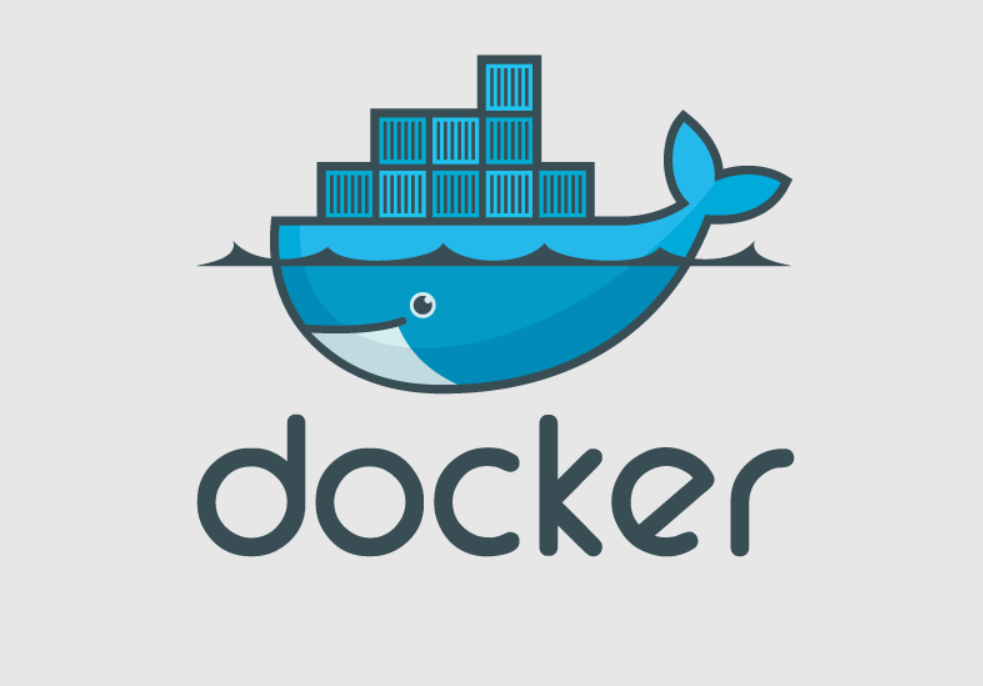 </a> <a href="https://kubernetes.io/"> 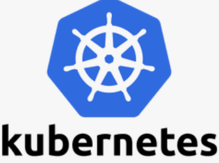 </a> <a href="https://helm.sh"> 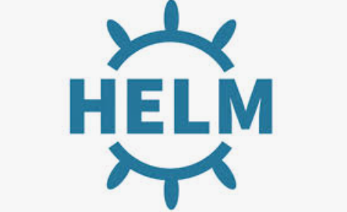 </a> <a href="https://nginx.org/en/"> 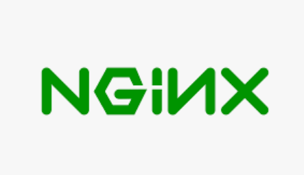 </a> <a href="https://cert-manager.io/"> 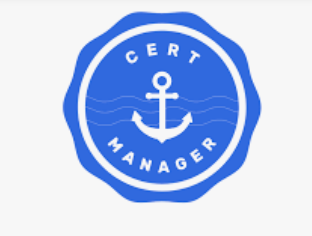 </a> <a href="https://argo-cd.readthedocs.io/en/stable/"> 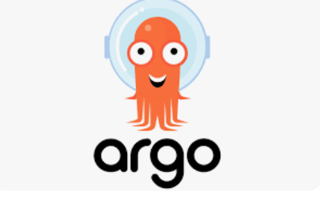 </a> <a href="https://prometheus.io/"> 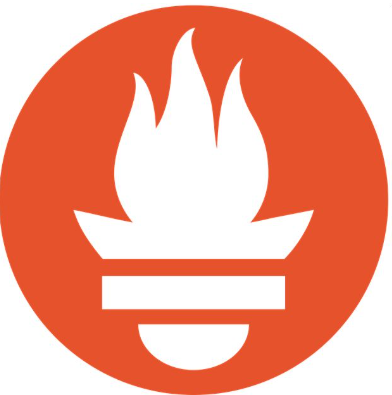 </a> <a href="https://grafana.com/"> 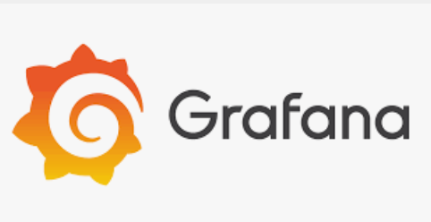 </a>  <a href="https://www.elastic.co/elasticsearch"> 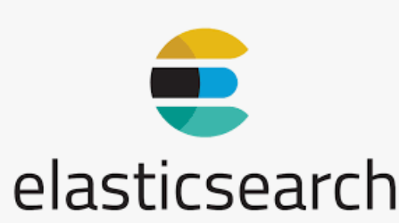 </a> 
<a href="https://www.elastic.co/kibana"> 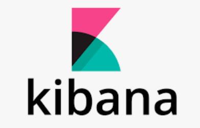 </a> <a href="https://www.fluentd.org/"> 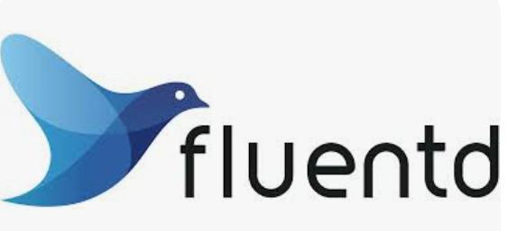 </a> 

