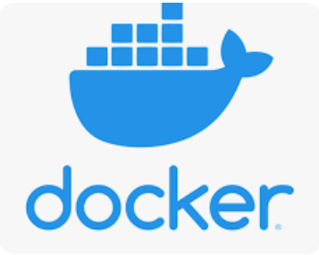

# About Me
## Hi there!👋 I am Uttiya Hazra, I cordially welcome you to check out my GitHub Profile.
  
- 🔭 I’m currently working on a [Illustrative Kubernetes Project](https://github.com/uttiyahazra/kubernetes-project)
- 🌱 I’m currently exploring Kubernetes in-depth and simultaneously learning DevOps concepts & practices including **VCS, CI-CD, Containerization, Monitoring & Logging** etc.
- 💬 Ask me about **Kubernetes**
- 📫 How to reach me: https://www.linkedin.com/in/uttiya-hazra-1a9714102/ 
- 👨‍💻 All of my projects are available at https://github.com/uttiyahazra/

# Tools & Technologies 
        

